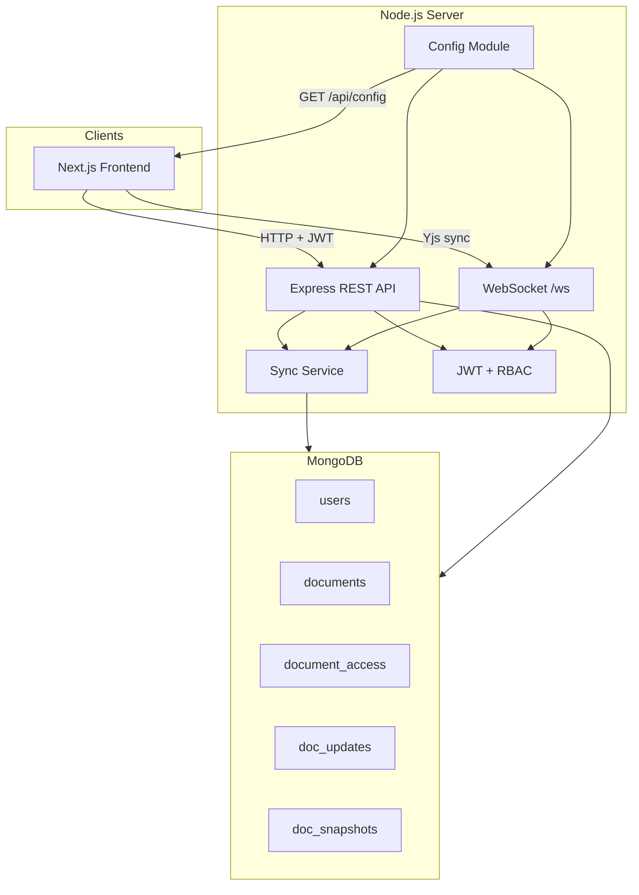

# Collaborative Editor Server

Node.js **REST API** + **WebSocket** sync server for a local-first collaborative document editor. Uses **Yjs CRDT** for conflict-free merging, **MongoDB** for persistence, and a single **runtime config contract** consumed by the frontend.

---

## Table of contents

- [Features](#features)
- [Architecture](#architecture)
- [Tech stack](#tech-stack)
- [Prerequisites](#prerequisites)
- [Quick start](#quick-start)
- [Scripts](#scripts)
- [Environment variables](#environment-variables)
- [API reference](#api-reference)
- [WebSocket sync](#websocket-sync)
- [Data model](#data-model)
- [Access control (RBAC)](#access-control-rbac)
- [Sync & persistence](#sync--persistence)
- [Version history & restore](#version-history--restore)
- [Security](#security)
- [Project structure](#project-structure)
- [Troubleshooting](#troubleshooting)

---

## Features

- User registration and JWT authentication
- Document CRUD with role-based access (`owner`, `editor`, `viewer`)
- Real-time collaborative editing over WebSocket (Yjs + `y-protocols`)
- Append-only update log with periodic auto-snapshots
- Manual snapshots and **restore-as-merge** (CRDT-safe rollback)
- Document sharing by registered email
- Optional AI text improvement (OpenAI)
- Public runtime config endpoint for the frontend (`GET /api/config`)
- Rate limiting, Helmet, CORS, message size caps, viewer write blocking

---

## Architecture



**Design principles**

1. **Single config source** — `src/config/index.js` drives ports, limits, Yjs field names, and the public client contract.
2. **CRDT over OT** — Yjs merges concurrent edits automatically; no central transform server.
3. **Append-only log** — every Yjs update is stored; snapshots compact replay cost.
4. **In-memory rooms** — active documents keep a live `Y.Doc` in memory; state is rebuilt from snapshot + updates on load.

---

## Tech stack

| Layer | Technology |
|-------|------------|
| Runtime | Node.js |
| HTTP | Express 5 |
| WebSocket | `ws` + `y-protocols` |
| CRDT | Yjs |
| Database | MongoDB (Mongoose) |
| Auth | JWT + bcrypt |
| Validation | Zod |

---

## Prerequisites

- **Node.js** 18+
- **MongoDB** (local or Atlas)
- Frontend running at `http://localhost:3000` (or update `CORS_ORIGINS`)

---

## Quick start

```bash
# 1. Clone and install
cd collaborative-editor-server
npm install

# 2. Configure environment
cp .env.example .env
# Edit .env — set MONGO_URI and JWT_SECRET at minimum

# 3. Start dev server (auto-frees port if orphaned)
npm run dev
```

Server starts at `http://localhost:8000` by default (see `PORT` in `.env`).

Verify:

```bash
curl http://localhost:8000/health
curl http://localhost:8000/api/config
```

---

## Scripts

| Command | Description |
|---------|-------------|
| `npm run dev` | Free port, then start with nodemon (graceful restart) |
| `npm start` | Production start |
| `npm run free-port` | Kill orphaned Node process holding `PORT` |

---

## Environment variables

Copy `.env.example` to `.env`. Key variables:

| Variable | Default | Description |
|----------|---------|-------------|
| `PORT` | `8000` | HTTP + WebSocket listen port |
| `HOST` | `0.0.0.0` | Bind address |
| `PUBLIC_URL` | — | Public API URL for `/api/config` (e.g. `https://api.example.com`) |
| `CLIENT_URL` | `http://localhost:3000` | Frontend origin (CORS fallback) |
| `CORS_ORIGINS` | — | Comma-separated allowed origins |
| `MONGO_URI` | — | **Required.** MongoDB connection string |
| `MONGO_DB_NAME` | `collaborative_editor` | Database name |
| `JWT_SECRET` | — | **Required.** Signing secret |
| `JWT_EXPIRES_IN` | `7d` | Token lifetime |
| `WS_PATH` | `/ws` | WebSocket mount path |
| `MAX_MESSAGE_SIZE` | `262144` | Max Yjs message bytes |
| `YJS_FIELD_NAME` | `prosemirror` | Must match TipTap collaboration field |
| `SNAPSHOT_INTERVAL` | `200` | Auto-snapshot every N persisted updates |
| `MAX_DOC_UPDATES` | `50000` | Max updates per document |
| `OPENAI_API_KEY` | — | Enables AI improve when set |

See `.env.example` for the full list (validation limits, storage keys, rate limits, etc.).

---

## API reference

All authenticated routes require:

```
Authorization: Bearer <jwt>
```

### Health & config

| Method | Path | Auth | Description |
|--------|------|------|-------------|
| `GET` | `/health` | No | `{ status: "ok" }` |
| `GET` | `/api/config` | No | Public runtime contract for frontend |

### Auth — `/api/auth`

| Method | Path | Body | Response |
|--------|------|------|----------|
| `POST` | `/register` | `{ email, password, name }` | `{ token, user }` |
| `POST` | `/login` | `{ email, password }` | `{ token, user }` |

### Documents — `/api/documents`

| Method | Path | Description |
|--------|------|-------------|
| `GET` | `/` | List documents for current user |
| `POST` | `/` | Create document `{ title }` |
| `GET` | `/:id` | Get document metadata + caller's role |
| `PATCH` | `/:id` | Update title (owner only) `{ title }` |
| `POST` | `/:id/share` | Share with user `{ email, role }` — `editor` or `viewer` |

**Share rules**

- Only the **owner** can share.
- Invitee must already be registered.
- Cannot share with yourself or change the owner's role.

### Snapshots — `/api/documents/:id/snapshots`

| Method | Path | Description |
|--------|------|-------------|
| `GET` | `/` | List snapshots (viewer+) |
| `POST` | `/` | Save snapshot `{ label? }` (editor+) |
| `POST` | `/:snapshotId/restore` | Restore snapshot as CRDT merge (editor+) |

### AI — `/api/ai`

| Method | Path | Body | Description |
|--------|------|------|-------------|
| `POST` | `/improve` | `{ text, instruction? }` | Returns `{ improved }` — requires `OPENAI_API_KEY` |

### Error format

```json
{ "error": "Human-readable message" }
```

Common status codes: `400` validation, `401` auth, `403` forbidden, `404` not found, `409` conflict, `503` AI not configured.

---

## WebSocket sync

**Endpoint:** `ws://<host>:<port>/ws?token=<jwt>&documentId=<id>`

| Query param | Description |
|-------------|-------------|
| `token` | JWT (configurable via `WS_TOKEN_PARAM`) |
| `documentId` | MongoDB document ObjectId |

**Protocol:** Yjs sync + awareness via `y-protocols` message types configured in `YJS_MESSAGE_SYNC` / `YJS_MESSAGE_AWARENESS`.

**Flow**

1. Server validates JWT and document access.
2. Loads document state (latest snapshot + subsequent updates).
3. Sends sync step 1 to client.
4. Client and server exchange Yjs updates.
5. Editor writes are persisted to `doc_updates` (viewers cannot write).

**Limits:** per-connection message rate (`WS_RATE_LIMIT`), max payload (`MAX_MESSAGE_SIZE`).

---

## Data model

| Collection | Purpose |
|------------|---------|
| `users` | `email`, `passwordHash`, `name` |
| `documents` | `title`, `ownerId` |
| `document_access` | `documentId`, `userId`, `role` |
| `doc_updates` | Append-only Yjs update log |
| `doc_snapshots` | Point-in-time Yjs state (`yjsState` Buffer) |

---

## Access control (RBAC)

| Role | Read | Edit | Share | Rename | Snapshots |
|------|------|------|-------|--------|-----------|
| `owner` | ✓ | ✓ | ✓ | ✓ | save + restore |
| `editor` | ✓ | ✓ | — | — | save + restore |
| `viewer` | ✓ | — | — | — | list only |

Enforced on every REST route and WebSocket connection via `access.service.js`.

---

## Sync & persistence

1. **Room** — in-memory `Y.Doc` per active document.
2. **Load** — apply latest snapshot, then replay updates after snapshot timestamp.
3. **Persist** — each client-originated update appended to `doc_updates`.
4. **Auto-snapshot** — every `SNAPSHOT_INTERVAL` updates, full state saved to `doc_snapshots`.

**Binary handling:** MongoDB `.lean()` returns BSON `Binary` for Buffer fields. Use `src/utils/binary.js` (`toUint8Array`) — never `new Uint8Array(binary)` directly.

---

## Version history & restore

- **Save** — encodes current in-memory `Y.Doc` state as a labeled snapshot.
- **Restore** — computes a Yjs diff from current state → snapshot state and applies it as a merge (not a destructive overwrite). Connected clients receive the update via WebSocket.

---

## Security

- Helmet HTTP headers
- CORS restricted to configured origins
- API rate limiting (`express-rate-limit`)
- JWT on all protected routes
- WebSocket auth + per-message rate limit
- Message size validation (REST + WS)
- Viewer role blocked from sending edits
- Password hashing with bcrypt

---

## Project structure

```
collaborative-editor-server/
├── index.js                 # Entry: Express + HTTP server + WS attach
├── scripts/
│   └── free-port.js         # Kill orphaned process on PORT
└── src/
    ├── config/
    │   ├── index.js         # Central config + getPublicConfig()
    │   ├── db.js            # MongoDB connection
    │   └── env.js           # Env parsing helpers
    ├── middleware/
    │   ├── auth.js          # JWT authenticate
    │   └── validate.js      # Zod body/params validation
    ├── models/              # Mongoose schemas
    ├── routes/              # Express routers
    ├── services/
    │   ├── document.service.js
    │   ├── sync.service.js  # Yjs rooms, persist, snapshots, restore
    │   └── access.service.js
    ├── utils/
    │   ├── binary.js        # BSON Binary → Uint8Array
    │   ├── jwt.js
    │   ├── errors.js
    │   └── serverLifecycle.js
    └── ws/
        └── syncServer.js    # WebSocket Yjs sync handler
```

---

## Troubleshooting

| Issue | Fix |
|-------|-----|
| `EADDRINUSE` on port | Run `npm run free-port` or `Ctrl+C` before closing terminal |
| Frontend can't connect | Check `PORT`, `CORS_ORIGINS`, and `PUBLIC_URL` |
| Restore fails / empty snapshot | Ensure binary utils are used when reading `yjsState` |
| WS closes immediately | Verify JWT, document access, and `documentId` query param |
| AI button missing | Set `OPENAI_API_KEY` in `.env` and restart |

---

## Related

Frontend: `collaborative-editor-client` — see its README for UI, offline sync, and config bootstrap.
